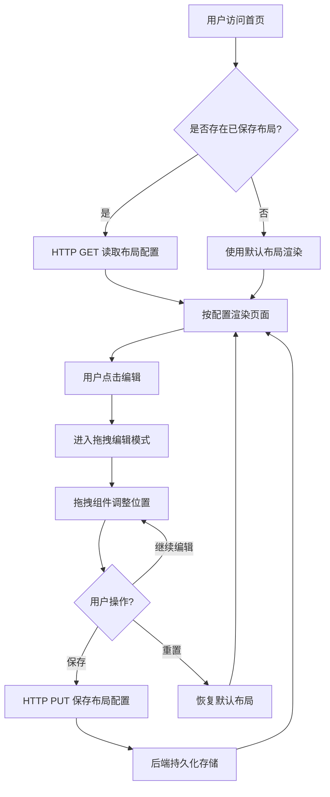

## 1. 产品概述

一个支持用户自定义首页组件布局的可视化平台。用户可通过拖拽操作自由排列首页上的功能模块（如天气、待办、数据卡片等），系统通过 HTTP API 将布局配置持久化保存，下次访问时自动读取并还原用户个性化布局。

- 解决用户对首页布局的个性化定制需求，提升产品体验与效率
- 面向需要自定义工作台/仪表盘的用户群体

## 2. 核心功能

### 2.1 用户角色

| 角色 | 注册方式 | 核心权限 |
|------|----------|----------|
| 普通用户 | 无需注册 | 拖拽排列组件、保存与读取布局 |

### 2.2 功能模块

1. **首页编辑器**：拖拽排列组件、实时预览、保存/重置布局
2. **首页展示**：根据保存的布局配置渲染页面

### 2.3 页面详情

| 页面名称 | 模块名称 | 功能描述 |
|----------|----------|----------|
| 首页 | 组件画布 | 展示可拖拽排列的组件网格，支持拖拽排序与位置互换 |
| 首页 | 工具栏 | 保存布局按钮、重置布局按钮、编辑/预览模式切换 |
| 首页 | 天气组件 | 展示模拟天气信息卡片 |
| 首页 | 待办组件 | 展示模拟待办事项列表 |
| 首页 | 数据统计组件 | 展示模拟数据统计图表 |
| 首页 | 快捷入口组件 | 展示常用功能快捷入口 |
| 首页 | 日历组件 | 展示模拟日历信息 |
| 首页 | 通知组件 | 展示模拟通知消息列表 |

## 3. 核心流程

用户进入首页后，系统通过 HTTP GET 请求从后端读取已保存的布局配置，若存在则按配置渲染组件顺序；若不存在则使用默认布局。用户点击编辑按钮进入编辑模式，通过拖拽操作调整组件位置，点击保存按钮后通过 HTTP PUT 请求将新布局配置发送至后端持久化存储。

## 4. 用户界面设计

### 4.1 设计风格

- 主色调：深靛蓝 (#1e1b4b) 搭配琥珀金 (#f59e0b) 作为强调色
- 辅助色：石板灰 (#64748b)、薄荷绿 (#34d399)
- 按钮风格：圆角胶囊按钮，带微投影
- 字体：标题使用 Playfair Display，正文使用 DM Sans
- 布局风格：卡片式网格布局，毛玻璃质感卡片
- 图标风格：线性描边图标 (Lucide Icons)
- 动效：拖拽时卡片浮起带阴影加深，放置时弹性回弹动画

### 4.2 页面设计概览

| 页面名称 | 模块名称 | UI 元素 |
|----------|----------|---------|
| 首页 | 组件画布 | 网格布局、毛玻璃卡片、拖拽手柄、弹性动画 |
| 首页 | 工具栏 | 固定顶栏、胶囊按钮、模式切换开关 |
| 首页 | 天气组件 | 图标+温度+城市、渐变背景卡片 |
| 首页 | 待办组件 | 复选框列表、进度指示条 |
| 首页 | 数据统计组件 | 柱状图/折线图、数据标签 |
| 首页 | 快捷入口组件 | 图标网格、悬浮放大效果 |
| 首页 | 日历组件 | 迷你日历视图、日期标记 |
| 首页 | 通知组件 | 消息列表、未读标记、时间戳 |

### 4.3 响应式设计

- 桌面优先设计，采用 CSS Grid 自适应列数
- 大屏 4 列、中屏 3 列、小屏 2 列、移动端 1 列
- 拖拽操作在桌面端使用鼠标事件，触控端使用 touch 事件
