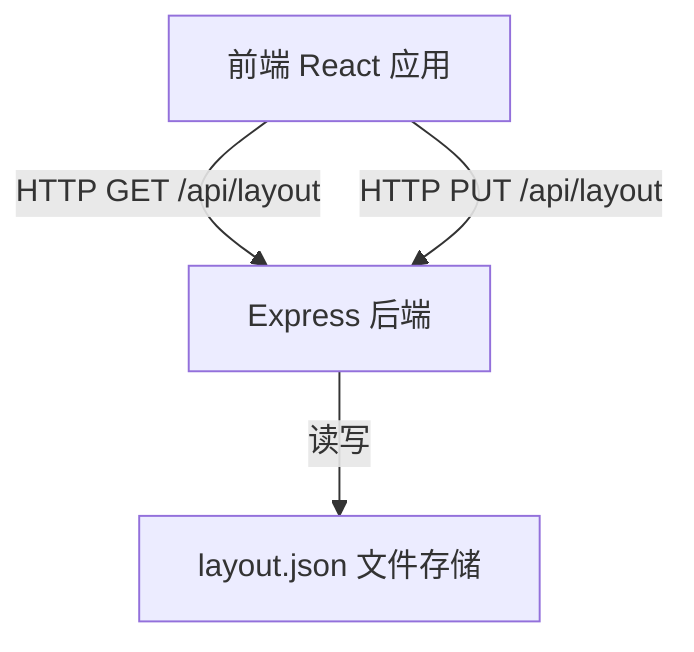
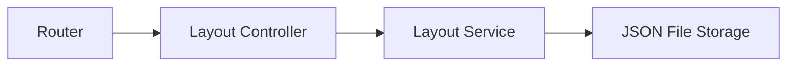
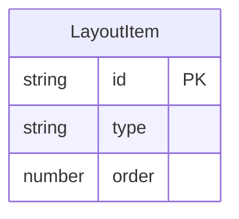

## 1. 架构设计



## 2. 技术说明

- 前端：React@18 + TailwindCSS@3 + Vite
- 拖拽库：@dnd-kit/core + @dnd-kit/sortable + @dnd-kit/utilities
- 初始化工具：Vite
- 后端：Express@4
- 数据存储：JSON 文件存储（layout.json）
- 图标：Lucide React

## 3. 路由定义

| 路由 | 用途 |
|------|------|
| / | 首页 - 展示可拖拽组件布局 |

## 4. API 定义

### 4.1 获取布局配置

```
GET /api/layout
```

**响应：**

```typescript
interface LayoutItem {
  id: string;
  type: "weather" | "todo" | "stats" | "shortcuts" | "calendar" | "notifications";
  order: number;
}

interface LayoutResponse {
  layout: LayoutItem[];
}
```

### 4.2 保存布局配置

```
PUT /api/layout
```

**请求体：**

```typescript
interface SaveLayoutRequest {
  layout: LayoutItem[];
}
```

**响应：**

```typescript
interface SaveLayoutResponse {
  success: boolean;
  layout: LayoutItem[];
}
```

### 4.3 重置布局配置

```
DELETE /api/layout
```

**响应：**

```typescript
interface ResetLayoutResponse {
  success: boolean;
  layout: LayoutItem[];
}
```

## 5. 服务器架构



## 6. 数据模型

### 6.1 数据模型定义



### 6.2 数据定义

布局数据存储在 `server/data/layout.json` 中：

```json
{
  "layout": [
    { "id": "weather", "type": "weather", "order": 0 },
    { "id": "todo", "type": "todo", "order": 1 },
    { "id": "stats", "type": "stats", "order": 2 },
    { "id": "shortcuts", "type": "shortcuts", "order": 3 },
    { "id": "calendar", "type": "calendar", "order": 4 },
    { "id": "notifications", "type": "notifications", "order": 5 }
  ]
}
```
